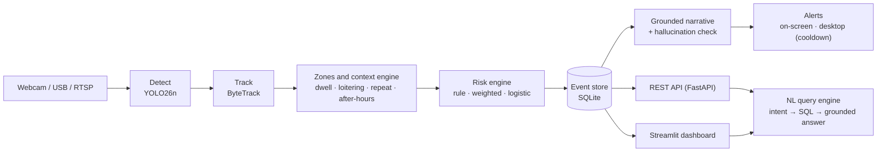

<h1 align="center">ContextGuard</h1>

<p align="center">
  <strong>Privacy-preserving, context-aware intrusion reasoning and grounded natural-language security intelligence for a single laptop webcam.</strong><br>
  No GPU. No mandatory cloud. No continuous video retention by default.
</p>

<p align="center">
  <a href="https://github.com/BakulBd/ContextGuard/actions/workflows/ci.yml"></a>
  <a href="#license"></a>
  
  
  
  
  <a href="#contributing"></a>
  
</p>

<p align="center">
  <a href="#quickstart">Quickstart</a> ·
  <a href="#installation">Installation</a> ·
  <a href="#usage">Usage</a> ·
  <a href="#rest-api">REST API</a> ·
  <a href="#configuration">Configuration</a> ·
  <a href="#deployment">Deployment</a> ·
  <a href="#contributing">Contributing</a>
</p>

---

**ContextGuard** turns an ordinary laptop webcam into a context-aware physical-security
sensor. It detects and tracks people with **YOLO26n + ByteTrack**, reasons about *where*
they are (user-drawn zones), *how long* they linger (dwell / loitering / repeat visits /
after-hours / abnormal zone transitions), scores the situation with a **swappable,
explainable risk engine**, records structured events to a local **SQLite** store, and
writes a **grounded** natural-language narrative for each one — with a built-in
hallucination checker so the prose can never claim something the event data doesn't
support. Ask it questions in plain English (*"How many high-risk events in the last
hour?"*), watch it live in a **Streamlit** dashboard, or integrate it through a
**FastAPI** REST service. Everything runs on CPU, on your machine, with anonymous
tracking as the default.

<!--
Keywords: computer vision, YOLO, YOLO26, ByteTrack, person detection, person tracking,
video surveillance, intrusion detection, security camera, privacy-preserving AI, edge AI,
CPU inference, on-device, loitering detection, anomaly detection, context-aware monitoring,
risk scoring, explainable AI, grounded text generation, hallucination detection,
natural-language query, LLM, small language model, SmolLM2, Streamlit, FastAPI, Prometheus,
Docker, systemd, Python, webcam security, physical security, home security, offline.
-->

## Table of contents

- [Why ContextGuard](#why-contextguard)
- [Key features](#key-features)
- [How it works](#how-it-works)
- [Requirements](#requirements)
- [Installation](#installation)
- [Quickstart](#quickstart)
- [Usage](#usage)
- [Natural-language queries](#natural-language-queries)
- [REST API](#rest-api)
- [Event schema](#event-schema)
- [Configuration](#configuration)
- [The risk engine](#the-risk-engine)
- [Training the risk model](#training-the-risk-model)
- [Comparing narration backends](#comparing-narration-backends)
- [Project status](#project-status)
- [Testing](#testing)
- [Deployment](#deployment)
- [Observability](#observability)
- [Project layout](#project-layout)
- [Roadmap](#roadmap)
- [Known limitations](#known-limitations)
- [FAQ](#faq)
- [Ethics and responsible use](#ethics-and-responsible-use)
- [Contributing](#contributing)
- [Security](#security)
- [License](#license)
- [Citation](#citation)
- [Acknowledgements](#acknowledgements)

## Why ContextGuard

Most "AI security camera" projects stop at *a person is on screen* and fire an alert.
That is noisy, context-free, and — because it usually ships frames to a cloud model —
a privacy problem. ContextGuard is built around three ideas:

| Idea | What it means here |
|---|---|
| **Context over detection** | An alert is a function of zone, time of day, dwell time, repeat visits and transition patterns — not just "a bounding box exists". Every context signal is something a human could verify with a clock and a stopwatch. |
| **Explainable, evaluable risk** | Three risk approaches (hand-rules, model-derived weights, logistic regression) share one feature set and one output shape, so you can compare them fairly against three naive baselines instead of trusting a black box. |
| **Privacy by construction** | Anonymous tracking (temporary IDs) is the default. No thumbnails are stored unless you opt in. No cloud LLM is wired into the default path. The narrator reports *observations*, never verdicts. Retention is actually enforced by a scheduled purge, not just a config value. |

It is a research / small-deployment tool — a dorm room, a server rack, a home office,
a doorway — not an enterprise VMS.

## Key features

- **CPU-only, real-time** — YOLO26n detection + ByteTrack tracking at **~23 FPS on a
  dev laptop CPU** (measure yours with `tools/benchmark_detector.py`), comfortably over
  the ≥10 FPS design target. No discrete GPU anywhere in the stack.
- **User-drawn zones** — rectangles over the area you want protected, marked `restricted`
  or `normal`, stored in normalised (0–1) coordinates so they survive a resolution
  change. Overlapping zones resolve to the **smallest containing** zone.
- **Rich temporal context** — per tracked person: zone entry/exit, dwell time, loitering
  (dwell past a threshold), repeat visits within a rolling window, after-hours activity
  (handles the overnight wrap), and *abnormal transitions* (appearing in a restricted
  zone without ever having passed through a normal one first).
- **Swappable risk engine** — Approach A (transparent point rules), Approach B (the same
  rule shape but with weights *derived* from a trained model), Approach C (logistic
  regression). Plus three baselines to beat. Every score comes with a human-readable
  breakdown of which factors contributed how many points.
- **Grounded narratives** — each event gets a plain-English description from a
  deterministic template generator, validated by `check_grounding()`, which flags three
  hallucination classes: wrong/missing **entity** (zone or identity), a **numeric** claim
  (duration) that doesn't match, and **accusatory language** the event never licenses
  (*criminal*, *intruder*, *suspect*, …). An **optional** small local model
  (`SmolLM2-360M-Instruct`, opt-in, no network at inference) is a drop-in comparison
  backend and passes through the same checker.
- **Natural-language queries** — a small semantic-parsing task, not a chatbot:
  intent + slot extraction → deterministic SQL filter → answer restricted to the
  retrieved rows.
- **Two front ends, one core** — a password-gateable **Streamlit dashboard** for humans,
  and an **opt-in FastAPI REST service** (API-key auth, rate limiting, Prometheus
  `/metrics`, JPEG snapshot + MJPEG stream) for machine integration.
- **Production-ready seams** — rotating file logs, camera auto-reconnect with backoff,
  per-frame *and* per-track fault isolation, env-var config overrides, retention purge
  timer, Docker image + systemd units, localhost-only binding *verified* (not assumed).
- **Honest about scope** — identity enrollment / Re-ID is a deliberately unbuilt seam;
  the code says so out loud. See [Project status](#project-status).

## How it works



```text
webcam -> detect (YOLO26n) -> track (ByteTrack) -> zones -> duration/loitering
       -> risk engine (rule / weighted / logistic regression)
       -> event store (SQLite) -> grounded narrative -> alert
       -> Streamlit dashboard  -or-  REST API (api/) for integration
```

A row is written to the event store **when a tracked person enters a zone, or starts
loitering** — each event is a discrete, human-reviewable observation, never a verdict.
All real logic lives in the `contextguard` package; the dashboard and the API are thin
presentation layers that both call `ContextGuardPipeline.step()` once per frame. A webcam
is exclusive-access hardware — run **one** front end at a time against a given camera.

## Requirements

- **A laptop with a webcam.** No discrete GPU required — everything runs on CPU. A USB
  camera or an `rtsp://` stream works too.
- **Python 3.10+.** Developed and tested against **3.14**, where two proposal-suggested
  dependencies have no wheels yet and were swapped out on purpose:
  - `onnxruntime` (no 3.14 build) → the pipeline uses Ultralytics' PyTorch backend
    directly instead of an ONNX export.
  - `shapely` (no 3.14 wheel, needs system GEOS to build) → `contextguard/geometry.py`
    implements point-in-polygon by hand in ~40 dependency-free lines.

  On an older Python both would work fine; the custom geometry code is simpler either way
  and was kept regardless.
- **Disk:** ~200 MB for the CPU-only PyTorch wheel, ~5 MB for the auto-downloaded
  `yolo26n.pt` weights, plus the local-LLM model download only if you opt into `[localllm]`.

## Installation

> `ultralytics` pulls in `torch`, and torch's **default** PyPI wheel bundles the full
> CUDA/cuDNN/NCCL stack (several GB) even on a machine with no GPU — exactly what this
> project doesn't need. Install the **CPU-only** torch build first, as shown below.

### Option A — uv (recommended)

[uv](https://docs.astral.sh/uv/) is faster, and its resolver doesn't spend minutes
backtracking on this dependency set the way plain pip can. `pyproject.toml` pins torch to
PyTorch's CPU-only index for uv automatically.

```bash
python3 -m venv .venv
source .venv/bin/activate            # .venv\Scripts\activate on Windows
pip install uv

uv pip install -e ".[dev]"           # one shot — the CPU-index pin handles torch
```

Slow or flaky connection? Stage it so one giant transaction isn't a single point of
failure:

```bash
uv pip install -e .                                                   # small deps first
uv pip install torch --index-url https://download.pytorch.org/whl/cpu # CPU-only torch, isolated
uv pip install opencv-python ultralytics lap                          # detector + tracker
```

### Option B — plain pip

`pip` does not read `pyproject.toml`'s uv index table, so install the CPU build
explicitly first:

```bash
python3 -m venv .venv
source .venv/bin/activate
pip install torch --index-url https://download.pytorch.org/whl/cpu
pip install -e ".[dev]"
```

### Optional extras

```bash
pip install -e ".[api]"                 # REST API — FastAPI, uvicorn, slowapi, prometheus-client
pip install -e ".[localllm]"            # local-model narrator — transformers, accelerate
pip install -e ".[dev,api,localllm]"    # everything
```

The first pipeline run downloads `yolo26n.pt` (~5 MB) automatically via Ultralytics.

### Option C — Docker (REST API service)

```bash
cp .env.example .env
$EDITOR .env                            # set CONTEXTGUARD_API_KEY at minimum
echo "VIDEO_GID=$(getent group video | cut -d: -f3)" >> .env   # Linux host: /dev/video0 access
docker compose up -d --build
curl http://127.0.0.1:8000/healthz
```

The image packages the **API service only** (not the dashboard). Camera passthrough works
on a **Linux Docker host** only. See [`deploy/README.md`](deploy/README.md) for
macOS/Windows notes and the full rationale.

## Quickstart

**1. Sanity-check the pipeline against your real webcam** (fastest way to confirm
detection / tracking / zones before touching a UI):

```bash
python scripts/run_headless.py           # press 'q' to quit; --camera 1 to pick a device
```

**2. Benchmark the detector on your machine** — published FPS numbers are measured on
specific hardware and shouldn't be trusted as-is for a different laptop:

```bash
python tools/benchmark_detector.py --source 0 --frames 150
python tools/benchmark_detector.py --compare     # yolo26n vs yolov8n, back to back
python tools/benchmark_detector.py --source synthetic   # no camera needed
```

**3. Run the dashboard:**

```bash
streamlit run dashboard/app.py           # binds to 127.0.0.1 only (see .streamlit/config.toml)
```

In the sidebar: set the camera source (default `0`), press **📷 Capture frame** under
**Zones** to grab a snapshot, drag a rectangle over the area you want protected, name it,
mark it `restricted` or `normal`, and save. Press **▶ Start** to begin monitoring. Ask
questions in the **Ask ContextGuard** tab.

## Usage

### Streamlit dashboard

Live annotated feed, zone editor, event log, timeline, natural-language query tab, and a
performance panel (FPS / CPU / RAM). Gate the whole thing behind a password by setting
`CONTEXTGUARD_DASHBOARD_PASSWORD` (compared with `hmac.compare_digest` — a shared-secret
check, not a session/auth system; pair with a reverse proxy + TLS for anything beyond
localhost).

### Headless / CLI

`scripts/run_headless.py` runs the full pipeline with an OpenCV preview window and no
Streamlit — the quickest way to debug camera or permission issues in isolation. New
events print to the console as grounded sentences.

## Natural-language queries

The query engine (`contextguard/nlp/query.py`) classifies an **intent**, extracts
**slots**, turns them into a SQL filter over the event store, and renders an answer built
**only** from the retrieved rows. Available in the dashboard's **Ask ContextGuard** tab
and via `POST /query`.

| It understands | Examples |
|---|---|
| **Intents** | count (`how many`, `count`, `number of`) · highest-risk (`highest-risk`, `worst`, `most severe`) · zone aggregate (`which zone`, `most incidents`, `busiest`) · otherwise a list summary |
| **Time windows** | `last 30 minutes`, `last 6 hours`, `last 7 days`, `today`, `yesterday`, `overnight` / `after midnight`, `between 1am and 5am` |
| **Risk slots** | `critical`, `high-risk`, `risk above 70` |
| **Other slots** | `unknown` / `unidentified` person · `loitering` · `repeated entry` · any zone name you've defined |

```text
"How many events in the last 30 minutes?"
"Which zone had the most incidents today?"
"Show me the highest-risk event yesterday."
"Any unknown people in the server rack overnight?"
"How many high-risk events in the last 7 days?"
"List loitering events between 1am and 5am."
```

## REST API

Opt-in (`pip install -e ".[api]"`). Single-process by design — a webcam can't be shared
across `gunicorn` workers, so scale reads with a cache in front of `/events` /
`/stream.mjpg`, never with `-w N`. See [`api/main.py`](api/main.py).

```bash
uvicorn api.main:app --host 127.0.0.1 --port 8000
# interactive docs: http://127.0.0.1:8000/docs
```

| Method & path | Purpose | Auth |
|---|---|---|
| `GET /healthz` | Liveness — `{status, camera_open, fps, frames_processed, uptime_seconds}` | none |
| `GET /readyz` | Readiness — `{ready}`; true once ≥1 frame is processed (distinct from liveness) | none |
| `GET /events` | List events — filters below | API key |
| `GET /events/{event_id}` | Single event, or 404 | API key |
| `GET /zones` | List zones (live from the running pipeline) | API key |
| `POST /zones` | Create a zone — accepts **any polygon** (≥3 points), not just rectangles; 422 on bad input | API key |
| `DELETE /zones/{name}` | Delete a zone (204), or 404 | API key |
| `POST /query` | `{question}` → `{text, intent, filters, rows[]}` — rate-limited **20/min** | API key |
| `GET /frame.jpg` | Latest annotated frame as JPEG, or 503 if none yet | API key |
| `GET /stream.mjpg` | `multipart/x-mixed-replace` MJPEG stream (~20 fps cap) for a custom front end | API key |
| `GET /metrics` | Prometheus exposition — see [Observability](#observability) | API key |
| `GET /docs` | Swagger UI | none |

**`GET /events` query params:** `time_from`, `time_to` (ISO 8601), `min_risk` (float),
`zone`, `identity`, `behavior_contains` (all substring matches), `limit` (1–1000,
default 100).

**Auth:** every route except `/healthz` / `/readyz` requires the `X-API-Key` header when
`CONTEXTGUARD_API_KEY` is set. With no key configured, the API falls back to
**loopback-only** access (403 for anything else). Rate limiting is in-memory via
`slowapi` — 120/min default, 20/min on `/query` — deliberately not Redis-backed because
the service is single-process by hardware necessity. Zone changes via the API are visible
to the running pipeline immediately (shared `ZoneManager`); the dashboard, editing a disk
file, reloads explicitly.

## Event schema

Each row in `data/contextguard.db` (and each `EventOut` from the API):

| Field | Type | Notes |
|---|---|---|
| `event_id` | int | Auto-increment primary key |
| `track_id` | int | ByteTrack's temporary per-session ID (never a stable identity) |
| `timestamp` | str | ISO 8601, local time |
| `identity` | str | `"unknown"` in anonymous mode (always, currently) |
| `zone` / `zone_kind` | str / null | Zone name and `"restricted"` \| `"normal"` \| null |
| `duration_seconds` | float | Dwell time in the zone at the moment of the event |
| `behavior` | list[str] | Tags: `loitering`, `repeated_entry`, `after_hours`, `abnormal_transition`, or `normal` |
| `risk_score` | float | 0–100 |
| `risk_level` | str | `low` \| `medium` \| `high` \| `critical` (thresholds below) |
| `risk_breakdown` | dict | `factor label → points contributed` |
| `narrative` | str | Grounded sentence(s); passes `check_grounding()` |
| `created_at` | str | ISO 8601 insert time |

## Configuration

Config loads once at startup from `config.yaml`, which is **created with sane defaults on
first run**. Treat it as a runtime artifact — it's gitignored. Any field can be overridden
from the environment with `CONTEXTGUARD_<FIELD_NAME>` (see [`.env.example`](.env.example)),
which is what systemd `EnvironmentFile=` and containers use.

| Setting | Default | Notes |
|---|---|---|
| `camera_source` | `"0"` | Webcam index (`"0"`, `"1"`, …) or an `rtsp://` URL |
| `capture_width` / `capture_height` | `640` / `480` | Capture resolution |
| `model_name` | `"yolo26n.pt"` | Any Ultralytics YOLO checkpoint; drop-in swappable |
| `device` | `"cpu"` | CPU-only is a hard design requirement here |
| `conf_threshold` | `0.35` | Detection confidence cutoff |
| `tracker_cfg` | `"bytetrack.yaml"` | Ultralytics tracker config |
| `narrator_backend` | `"template"` | `"template"` (deterministic, zero deps) or `"local_llm"` (opt-in) |
| `local_llm_model` | `"HuggingFaceTB/SmolLM2-360M-Instruct"` | Used only when `narrator_backend = "local_llm"` |
| `loiter_seconds` | `30` | Dwell time that counts as loitering |
| `repeat_visit_window_minutes` | `60` | Rolling window for counting repeat visits |
| `repeat_visit_threshold` | `2` | Visits within the window that flag `repeated_entry` |
| `after_hours_start` / `after_hours_end` | `22:00` / `07:00` | After-hours window (overnight wrap handled) |
| `track_expiry_seconds` | `5` | Drop a track this long after it was last seen |
| `risk_mode` | `"rule"` | `"rule"` (Approach A) · `"weighted"` (B) · `"ml"` (C) |
| `alert_cooldown_seconds` | `60` | Per-track alert de-duplication |
| `alert_risk_level` | `"high"` | Minimum level that fires a desktop notification |
| `desktop_notifications` | `true` | OS-level notification on qualifying alerts |
| `db_path` / `zones_path` | `data/…` | Event DB and zone definitions on disk |
| `retention_days` | `30` | Enforced by `tools/purge_old_events.py` on a schedule |
| `store_thumbnails` | `false` | Off by default — privacy |
| `blur_faces_in_thumbnails` | `true` | Applies when thumbnails are enabled |
| `identity_mode` | `"anonymous"` | `"enrolled"` is a deliberately unbuilt seam |

Risk thresholds (`risk_thresholds` block): `medium: 30`, `high: 60`, `critical: 85`;
below `medium` is `low`.

## The risk engine

All three approaches consume the same `RiskFeatures` and emit the same
`RiskResult` (`score` 0–100, `level`, and a `breakdown` dict of contributing factors), so
they're swappable and comparable.

| Factor | Default points (Approach A) |
|---|---|
| Restricted-zone entry | 30 |
| Unusual hour (after-hours) | 20 |
| Prolonged presence (loitering) | 15 |
| Unknown identity | 12 |
| Repeated entry | 10 |
| Abnormal zone transition | 8 |

- **Approach A — `RuleRiskEngine` with default weights.** Transparent, hand-picked point
  values. The naive starting point, and the thing the project explicitly should *not*
  stop at.
- **Approach B — `RuleRiskEngine` with derived weights.** Same additive-points formula,
  but the weights come from `derive_weights_from_model()` applied to Approach C's fitted
  coefficients — interpretable *and* data-driven. (Negative coefficients are floored at
  zero, documented as a real simplification.)
- **Approach C — `LogisticRiskEngine`.** A scikit-learn `StandardScaler +
  LogisticRegression` pipeline trained on labeled `(features → should this have
  alerted?)` rows. Its breakdown is a post-hoc approximation — Approach B exists so an
  explanation doesn't have to be.

**Baselines to beat** (`contextguard/risk.py`): (1) any person detected, (2) any unknown
person, (3) unknown person in a restricted zone.

`create_risk_engine()` falls back to Approach A if the `weighted` / `ml` artifacts don't
exist yet — the live pipeline never hard-fails just because you haven't collected labeled
data.

## Training the risk model

Approaches B and C need real labeled data — they're not meaningful trained on a handful
of clicks.

```bash
# after collecting staged scenarios with the pipeline running:
python tools/train_risk_model.py export data/contextguard.db data/labeling_template.csv
# open the CSV, fill in `should_alert` (0/1) for each row by hand
python tools/train_risk_model.py train data/labeling_template.csv \
    --weights-out data/risk_weights.json --model-out data/risk_model.joblib
# then set risk_mode: weighted (Approach B) or ml (Approach C) in config.yaml
```

`train` prints a held-out evaluation and the derived Approach B point weights.

## Comparing narration backends

```bash
pip install -e ".[localllm]"     # first time only — downloads SmolLM2-360M-Instruct on first use
python tools/compare_narrators.py data/contextguard.db --with-local-llm --limit 100
```

Reports the grounding-check pass rate and latency for the template generator vs. the
small local model, side by side, over your actual recorded events, and prints sample
grounding failures with reasons.

## Project status

The full core pipeline works end to end and was verified against a real webcam and a real
API server *while it was built* — see [Verified, not assumed](#verified-not-assumed).

| Piece | Status |
|---|---|
| Camera abstraction, YOLO26n detection, ByteTrack tracking | ✅ implemented |
| Zone drawing (rectangles), entry/exit/dwell/loitering/repeat-visit/abnormal-transition | ✅ implemented |
| Risk engine — Approach A (rule) + baselines 1–3 | ✅ implemented, live default |
| Risk engine — Approach B (model-derived weights) | ✅ implemented; run `tools/train_risk_model.py` on your data first |
| Risk engine — Approach C (logistic regression) | ✅ implemented; same data dependency as B |
| Event store, retention / purge | ✅ implemented |
| Grounded template narration + `check_grounding()` hallucination checker | ✅ implemented |
| Small local-model narration backend (`nlp/local_llm.py`) | ✅ implemented, opt-in (`.[localllm]`) |
| Natural-language query engine (intent/slot → SQL → grounded answer) | ✅ implemented |
| Streamlit dashboard (feed, zones, events, timeline, NL query, perf) | ✅ implemented, password-gateable |
| REST API — events/zones/query/frame/stream/health/metrics, API-key auth, rate limiting | ✅ implemented, opt-in (`.[api]`) |
| Local desktop alerts (cooldown + minimum level) | ✅ implemented |
| Docker image + systemd units | ✅ implemented (Docker not build-tested — no Docker in the build sandbox) |
| Identity enrollment / Re-ID (Mode 1) | ⛔ **not implemented** — deliberately deferred; see `contextguard/identity.py`. Always runs anonymous (temporary track IDs). |
| External-LLM narration comparison point | ⛔ **not wired in** — a cloud LLM belongs only in an explicit, separate research harness, never in the default path against recorded events. |

### Verified, not assumed

Every claim below was checked against a real run, not just written and hoped for:

- YOLO26n loads, downloads its weights (5.3 MB), and runs inference on a dev laptop CPU
  at **~24 FPS synthetic / ~23 FPS live camera**, over the ≥10 FPS target — via
  `tools/benchmark_detector.py --source synthetic` and a live end-to-end run against
  `/dev/video0`.
- The full pipeline (`ContextGuardPipeline`) runs against a real webcam frame-by-frame
  with no crashes.
- The real (non-test-double) API service boots, opens the camera, serves `/healthz`,
  `/events`, `/zones`, `/metrics` and a live `/frame.jpg`, and correctly returns 401
  without an API key and 200 with one.
- The Streamlit dashboard, run with zero flags, was confirmed via `ss -tlnp` to bind to
  `127.0.0.1` only — *not* Streamlit's out-of-the-box default (see
  `.streamlit/config.toml`).
- All **81** automated tests pass on Python 3.14.

## Testing

Everything that doesn't need a camera or a downloaded model is unit-tested — geometry,
zones (including nested-zone resolution), the context/duration state machine, all three
risk engines and the baselines, the event store, the grounded narrator and its
hallucination checker, the NL query engine (intent + slots + grounded answers), the
local-LLM prompt builder, and the full REST API (via a fake injected pipeline service —
see `api/state.py`'s `set_service` seam):

```bash
pytest      # 81 tests, no camera or model download required
```

CI (`.github/workflows/ci.yml`) runs the suite on Python **3.11 / 3.12 / 3.14**, plus
import-checks for the dashboard, tools and API app, and a Docker build-only job — on
every push and PR.

## Deployment

Running ContextGuard as a standing service (survives reboots, restarts on crash, enforces
retention automatically, gated behind a password / API key once it's reachable beyond
your own machine) is covered in **[`deploy/README.md`](deploy/README.md)** — systemd
units for Linux, a restart-loop script (`scripts/serve.sh`) for everything else, and a
`Dockerfile` / `docker-compose.yml` for the API service.

Production-relevant pieces built **into** the app, not bolted on:

- **Logging** — every module logs through `contextguard/logging_setup.py` to console and
  a rotating file (`data/logs/contextguard.log`, 5 MB × 5). `CONTEXTGUARD_LOG_LEVEL=DEBUG`
  for more.
- **Camera resilience** — `CameraSource` auto-reconnects with backoff after repeated read
  failures (unplug, sleep/wake).
- **Fault isolation** — `ContextGuardPipeline.step()` catches and logs exceptions
  per-frame *and* per-track; the API's capture thread pauses briefly and continues on an
  unhandled error instead of dying.
- **Config via environment** — any field as `CONTEXTGUARD_<FIELD_NAME>`, for systemd
  `EnvironmentFile=` or a container.
- **Dashboard auth + API auth** — password gate / `X-API-Key`, both falling back to
  loopback-only when unset.
- **Localhost-only binding, verified** — `.streamlit/config.toml` pins
  `server.address = "127.0.0.1"`; re-checked with `ss -tlnp`. The API's container binds
  `0.0.0.0` *inside* the container; the real boundary is the host mapping
  (`127.0.0.1:8000:8000`).
- **Retention enforcement** — `tools/purge_old_events.py` (with `--dry-run` and `--days`)
  on a daily systemd timer (`Persistent=true`, randomised delay) actually deletes events
  past `retention_days`.
- **Hardened units** — the systemd service sets `NoNewPrivileges=true`,
  `ProtectSystem=full`, `Restart=on-failure`.

## Observability

`GET /metrics` returns Prometheus exposition format (behind the same API-key/loopback
rule — Prometheus can send a bearer token or header in its scrape config):

| Metric | Type | Meaning |
|---|---|---|
| `contextguard_fps` | gauge | Current processing FPS |
| `contextguard_cpu_percent` | gauge | Capture-process CPU % |
| `contextguard_memory_mb` | gauge | Capture-process RSS memory (MB) |
| `contextguard_uptime_seconds` | gauge | Seconds since the capture loop started |
| `contextguard_frames_processed_total` | counter | Frames processed since process start |
| `contextguard_events_total` | gauge | Rows currently in the event store |

Plus `GET /healthz` (liveness) and `GET /readyz` (readiness) for probes and load
balancers.

## Project layout

```text
contextguard/            # all real logic — camera/tracking swappable, everything else stable
  camera.py                # webcam / USB / rtsp:// abstraction, auto-reconnect with backoff
  tracking.py              # YOLO26n detection + ByteTrack (Ultralytics' built-in tracker)
  geometry.py              # dependency-free point-in-polygon + coordinate normalisation
  zones.py                 # zone CRUD + persistence (data/zones.json), nested-zone resolution
  context.py               # per-track dwell, loitering, repeat visits, after-hours, transitions
  risk.py                  # Approaches A/B/C + the 3 naive baselines
  events.py                # SQLite event store + filtered query + purge
  alerts.py                # on-screen + desktop notification, with cooldown and min level
  identity.py              # Mode 1 seam — not implemented, see Project status
  perf.py                  # FPS / CPU / RAM, shared by dashboard, API and benchmark
  logging_setup.py         # rotating file + console logging
  pipeline.py              # wires all of the above into one per-frame step()
  nlp/
    generate.py            # grounded template narration + check_grounding()
    local_llm.py           # small local-model narration backend, same generate(event) interface
    query.py               # intent/slot parsing -> SQL filter -> grounded answer
api/                     # REST API (optional, .[api]) — single-process rationale in main.py
  main.py                  # FastAPI app, lifespan-managed capture thread
  state.py                 # the one running pipeline + latest frame, shared across requests
  security.py              # API-key auth (loopback fallback) + rate limiting
  schemas.py               # Pydantic request/response models
  routes/                  # health, events, zones, query, stream (MJPEG/JPEG), metrics
dashboard/app.py         # Streamlit UI (presentation only), password-gateable
.streamlit/config.toml   # pins the dashboard to 127.0.0.1
scripts/
  run_headless.py          # cv2.imshow sanity check, no Streamlit  (--camera N)
  serve.sh                 # production entrypoint w/ restart-on-crash (non-systemd hosts)
tools/
  benchmark_detector.py    # FPS/latency/memory on this machine, with a --compare mode
  train_risk_model.py      # label export + Approach B/C training (export | train subcommands)
  purge_old_events.py      # retention enforcement, meant to run on a schedule (--dry-run)
  compare_narrators.py     # template vs. local-LLM grounding-pass-rate comparison
deploy/                  # systemd units (+ timer) + deployment instructions
Dockerfile, docker-compose.yml, .dockerignore   # containerised API service
.github/                 # CI, Dependabot, issue/PR templates
tests/                   # pytest, no camera or model download required (81 tests)
```

## Roadmap

- WebSocket / `streamlit-webrtc` live feed (lower latency than the process-one-frame-then-`st.rerun()` pattern).
- Arbitrary polygon zones in the dashboard (the REST API already accepts them).
- A separate, explicit research harness for external-LLM narration comparison — never in the default path.
- Optional identity enrollment / Re-ID as a clearly-labelled non-default mode (`contextguard/identity.py` seam).
- Packaged console entry points (`contextguard-dashboard`, `contextguard-serve`).

See [`CHANGELOG.md`](CHANGELOG.md) for released changes.

## Known limitations

- **Live feed** uses Streamlit's standard one-frame-per-rerun pattern — it works, but a
  WebSocket front end would be smoother. `/stream.mjpg` on the API is the lower-latency
  path for a custom UI.
- **Zone drawing is rectangles only** in the dashboard —
  `streamlit-drawable-canvas`'s polygon mode encodes vertices as an SVG path that wasn't
  worth parsing blind. `POST /zones` accepts any polygon programmatically.
- **Camera permissions on Linux** — if `scripts/run_headless.py` can't open the camera,
  confirm your user is in the `video` group and no other app (browser tab, video call)
  holds the device.
- **The API is single-process by design** — don't run it under `gunicorn -w N`; each
  worker would fight over the one camera.
- **Docker is not build-tested** — no Docker in the sandbox this was built in. It follows
  the same CPU-only-torch-first order proven locally and in CI; treat your first build as
  the real test. The image is API-only (`.dockerignore` excludes the dashboard, tools,
  tests and docs).

## FAQ

**Does anything leave my machine?** No, not in the default path. Detection, tracking,
risk scoring and template narration are fully local. The only network activity is the
one-time model-weights download. The optional local LLM also runs offline after its
first download. A cloud LLM is deliberately *not* wired in.

**Is video recorded?** No continuous recording. Events are structured rows in a local
SQLite DB. Thumbnails are off by default (`store_thumbnails: false`) and face-blurred
when enabled.

**Do I need a GPU?** No. CPU-only is a hard design constraint, not a fallback.

**Can it recognise specific people?** Not currently — it runs anonymous (temporary track
IDs) by design. `contextguard/identity.py` is a documented, unbuilt seam.

**Why YOLO26n?** Faster CPU inference at higher accuracy than YOLOv8n per Ultralytics'
published benchmarks, and a drop-in swap (same `ultralytics.YOLO` API). Re-verify on your
hardware with `tools/benchmark_detector.py --compare` before trusting any number.

**Dashboard or API?** The dashboard for a single local user (zero extra deps). The API
for headless/server use or integrating events into another system. One at a time per
camera.

**What counts as an "event"?** A tracked person entering a zone, or starting to loiter.
Not every frame, and not "a person exists".

## Ethics and responsible use

ContextGuard points a camera at people. Before you deploy it:

- **Only monitor spaces you own or are authorised to monitor.** Camera surveillance is
  regulated in many jurisdictions (GDPR, CCPA, state / "two-party" laws, workplace
  rules). Complying is your responsibility.
- **Tell people they're being recorded** where required, with signage or notice.
- **Keep it anonymous.** The default anonymous mode is the intended one. Don't bolt on
  face recognition to identify people without consent and a lawful basis.
- **Mind retention.** Lower `retention_days` to the minimum you actually need and keep
  the purge timer running.
- Don't use it to harass, stalk, or monitor individuals without their knowledge.

## Contributing

Contributions are welcome. Please read **[`CONTRIBUTING.md`](CONTRIBUTING.md)** and the
**[Code of Conduct](CODE_OF_CONDUCT.md)** first. In short:

1. Open an issue describing the change before a large PR.
2. `pip install -e ".[dev,api]"` and make `pytest` green (add tests for new behaviour).
3. Match the style and comment density of the surrounding code.
4. Uphold the project's **"verified, not assumed"** ethos — if you claim something works,
   check it against a real run and say how.

## Security

Found a vulnerability? **Please don't open a public issue.** See
**[`SECURITY.md`](SECURITY.md)** for private reporting. Note that the dashboard password
gate and API-key check are shared-secret mechanisms for a research/small-deployment tool
— put a TLS-terminating reverse proxy in front of anything reachable beyond localhost.

## License

This project's own source code is released under the **[MIT License](LICENSE)** —
© 2026 Bakul Ahmed.

**Third-party components keep their own licenses**, and one matters for redistribution:

| Component | License | Note |
|---|---|---|
| [Ultralytics YOLO](https://github.com/ultralytics/ultralytics) (`ultralytics`, YOLO26n weights) | **AGPL-3.0** (or a paid Ultralytics Enterprise license) | Used in the default detection path. If you redistribute ContextGuard or offer it as a network service, AGPL-3.0's terms apply to that use of Ultralytics — get the Enterprise license if that doesn't work for you. |
| [PyTorch](https://github.com/pytorch/pytorch) | BSD-3-Clause | CPU-only wheel |
| [SmolLM2-360M-Instruct](https://huggingface.co/HuggingFaceTB/SmolLM2-360M-Instruct) | Apache-2.0 | Only if you opt into `[localllm]` |
| Streamlit, FastAPI, Uvicorn, scikit-learn, OpenCV, pandas, and other deps | Apache-2.0 / MIT / BSD | See each project |

The MIT license on ContextGuard's code does not override the obligations of its
dependencies. If AGPL-3.0 is a problem for your use, set `model_name` to a non-AGPL
detector and remove `ultralytics` from `pyproject.toml`.

## Citation

If ContextGuard is useful in your research, please cite it. Metadata lives in
[`CITATION.cff`](CITATION.cff) (GitHub renders a **"Cite this repository"** button from
it).

```bibtex
@software{ahmed_contextguard_2026,
  author  = {Ahmed, Bakul},
  title   = {ContextGuard: Privacy-Preserving, Context-Aware Intrusion Reasoning for a Laptop Webcam},
  year    = {2026},
  version = {0.1.0},
  url     = {https://github.com/BakulBd/ContextGuard}
}
```

## Acknowledgements

- [Ultralytics](https://github.com/ultralytics/ultralytics) for the YOLO + ByteTrack implementation.
- [Hugging Face SmolLM2](https://huggingface.co/HuggingFaceTB) for the small instruct model used in the optional narrator comparison.
- The [Streamlit](https://streamlit.io/) and [FastAPI](https://fastapi.tiangolo.com/) projects for the two front ends.

---

<p align="center"><sub>
Suggested GitHub repo topics:
<code>computer-vision</code> · <code>yolo</code> · <code>bytetrack</code> · <code>object-tracking</code> ·
<code>intrusion-detection</code> · <code>security-camera</code> · <code>privacy</code> · <code>edge-ai</code> ·
<code>cpu-inference</code> · <code>anomaly-detection</code> · <code>streamlit</code> · <code>fastapi</code> ·
<code>llm</code> · <code>grounded-generation</code> · <code>python</code>
</sub></p>
